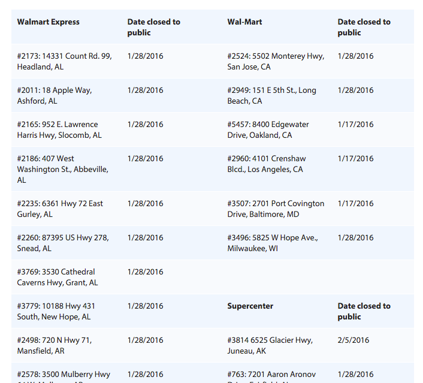

```{r setup, include=FALSE}
knitr::opts_chunk$set(echo = TRUE)
library(DataComputing)
```

[This example is based on a presentation given by David Radcliffe at the Twin Cities R Users' Group meeting at Macalester College in February 2016.  See [his slides](http://rpubs.com/Radcliffe/walmart-TCRUG)]. ]

On January 15, 2016, the retailing giant Walmart announced the closing of 154 stores in the US.  Walmart published a list of the stores at the web site given below.  

The list looks like this:



[Link to the actual site](http://news.walmart.com/news-archive/2016/01/15/walmart-continues-sharpened-focus-on-portfolio-management)

# Grabbing the table from the site

1. Capture the web page:
```{r}
url_for_walmart_closings <- "http://news.walmart.com/news-archive/2016/01/15/walmart-continues-sharpened-focus-on-portfolio-management"
web_page <- xml2::read_html(url_for_walmart_closings)
```
2. Parse the HTML table
```{r}
library(rvest)
Raw_data <- 
  web_page %>%
  html_node("table") %>%
  html_table()
```
3. Take the 4-column layout to two columns.
```{r}
Left <- 
  Raw_data %>%
  select(c(1,2))
names(Left) <- c("one", "two")

Right <- Raw_data %>%
  select(c(3,4))
names(Right) <- names(Left)

Both <- rbind(Left, Right)
```
4. Figure out which rows correspond to the store type
```{r}
Store_types <- 
  Both %>%
  mutate(index = row_number()) %>%
  filter(grepl("Date closed", two)) %>%
  mutate(until = lead(index, 1) - 1) %>%
  mutate(until = ifelse(is.na(until), nrow(Both), until))
# How to do this in dplyr?
store_type <- character(nrow(Both))
for (k in 1:nrow(Store_types)) {
  store_type[Store_types$index[k]:Store_types$until[k] ] <- Store_types$one[k]
}
```

```{r}
Both$type <- store_type
Cleaned <- 
  Both %>%
  filter(grepl("^#", one)) %>%
  mutate(date = lubridate::mdy(two)) %>%
  mutate(store_number = stringr::str_extract(one, "[0-9]{3,6}")) %>%
  mutate(location = gsub("^#[0-9]{3,6}[:,]?", "", one)) %>%
  mutate(state = stringr::str_extract(location, "[A-Z]{2}$")) %>%
  mutate(city = gsub("^[^,]+,", "", location)) %>%
  select(-one, -two)
```
5. Geocode the stores and add info for popups and colors
```{r eval = FALSE}
library(ggmap)
# lat_long <- geocode(Cleaned$location)
# save(lat_long, file = "Geocoded_stores.rda")
```

```{r}
load("/Users/kaplan/KaplanFiles/DataComputing/DataComputing-Instructors/Activities/Geocoded_stores.rda")
Cleaned <- cbind(Cleaned, lat_long) 
```

```{r}
library(visNetwork)
Marker_colors <- 
  Store_types %>%
  mutate(color = rainbow(nrow(.))) %>%
  select(type = one, color)
For_map <- 
  Cleaned %>%
  left_join(Marker_colors) %>%
  mutate(popups = paste0(
  "<b>", 
  type, 
  "</b><br>", 
  location, 
  "<br>",
  "Date closed: ",
  date)) 
```

6. Draw the map
```{r}
library(leaflet)
map <- 
  leaflet() %>%
  addTiles() %>%
  setView(lng = -90, lat = 40, zoom = 5)
map %>%
  addCircleMarkers(lng = Cleaned$lon, lat = Cleaned$lat, popup = Cleaned$popups,
                   fillColor = Cleaned$color)
```  
